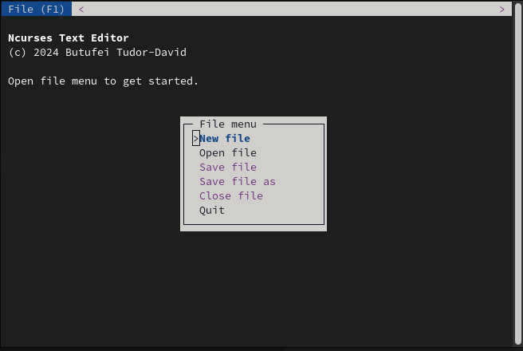

# Ncurses Text Editor

This repository contains the code of the project for Operating Systems course, taken at Faculty of Mathematics and Computer Science, University of Bucharest (2nd semester, 3rd year).

This is a simple terminal text editor built using the ncurses library.

## Features

- Manage multiple files in tabs
- Operations to create file, open file, save file, close file
- Text selection support (by pressing the shift key and moving cursor)
- Editor wide clipboard (with shortcuts: Ctrl + C for copy, Ctrl + V for paste, Ctrl + X for cut, Ctrl + Y for deleting the selection)
- Support for terminal resizing
- Unsaved file close confirmation

## Usage

- File menu can be activated by pressing `F1` or by clicking the `File` button in the application top bar
- Change current tab by pressing `Alt + Right` or `Alt + Left` or by clicking on a tab
- Menu navigation using arrow keys, apply selected action by pressing enter or by selecting shortcut letter or by clicking menu option
- When editing a file, cursor position can be moved using arrow keys
- To start a selection, press shift while moving cursor

## Build

Prerequisites: ncurses development library.

### Build project
- `make`
- `./main`

### Build file data unit tests
Unit tests used to check if FileData structure perserves integrity after modifications.

- `make unit_testing`
- `./unit_testing`

### Clean workspace
- `make clean`

## Architecture

The program is split into multiple modules:

- `FileData` represents the file as a linked list of display lines
- `FileView` handles the view of a file tab (rendering and file input)
- `TextEditor` renders the whole application and manages file tabs and application menu
- `Dialogs` utilities to display dialogs (text input, confirm and alert)
- `Colors` utilities related to terminal colors
